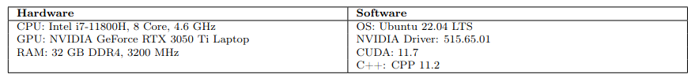
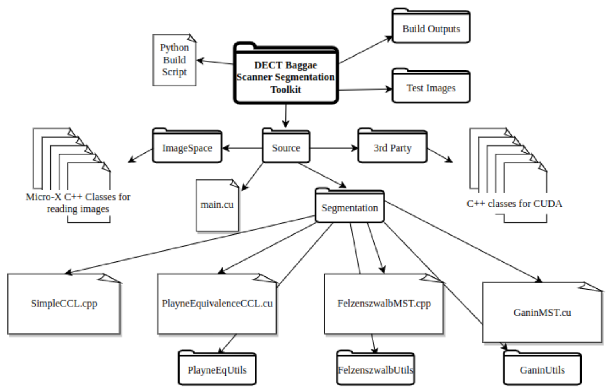
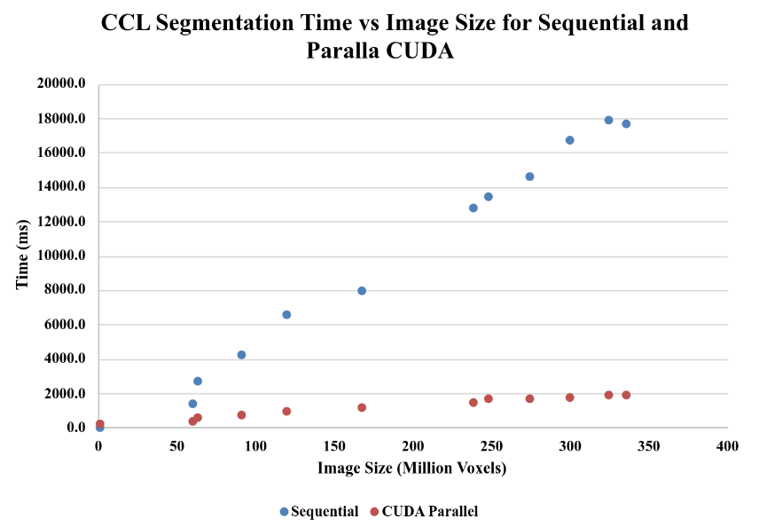
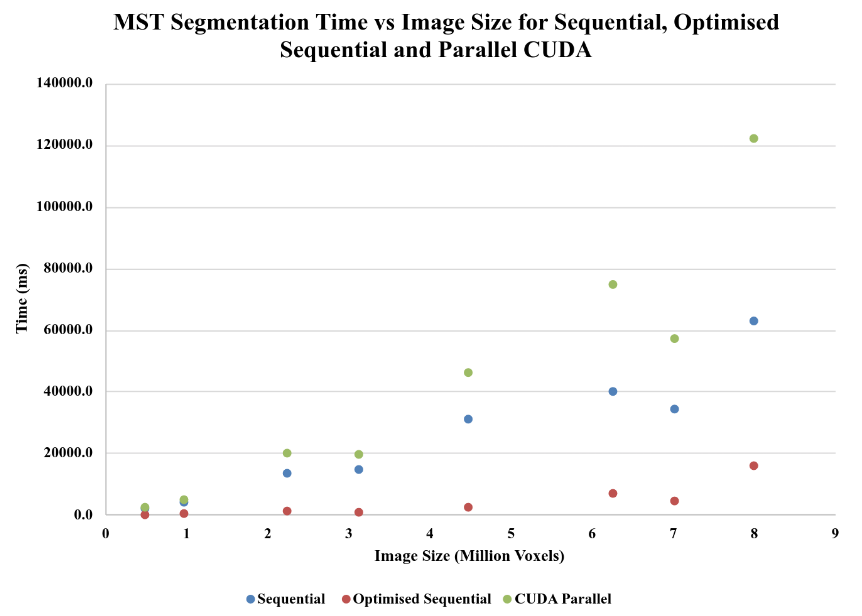

# ImageSegmentation

Repository to for CS-155 Algorithmic Segmentation and CS-156 Implement Advanced Segmentation Solution.  

## Input data  
Get the input folder from the link below, unzip and put the folder ("input/") in the "test" folder  after git cloning (so "test/input/"). This is necessary as the data is too large to upload to GitHub.  
URL: https://flinders-my.sharepoint.com/:u:/g/personal/duns0089_flinders_edu_au/EesXhHx6lnVMiAvKEGI2UlUBbLlfCROKaK_QtE_k2UQDSw?e=sdEmWg  

## System
### Test Computer Specifications:

The Meson Build System is also required, v0.61.2.  
Python 3.10.4.  

## Toolkit Architecture

## Running the toolkit
There a number of ways to run the toolkit. The easiest way is to use the *./run-test.sh* file. This file contains a number of commented out lines that correspond to the the files that will be segmented. The -r option means that minimal spanning tree segmentations will occur and need reconstruction greyscale image. The non -r option requires a uintt_8 file with the material compounds look up table specified as well.  

## Test Results
These are the results from the thesis located in documention/. 

